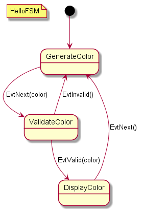

nf.state-flow
=============

[flow.puml](flow.puml)


# introduce

this is sample stateflow. When I making a game(in unity), I want generate state class and uml for share. so I'm writing custom class generator, and uml exporter for that work.

It inspired by [bitcraftCoLtd/finite-state-machine](https://github.com/bitcraftCoLtd/finite-state-machine). you will like that also.


# flow

1. input_state.ss

```scheme
(def-fsm HelloFSM
  (GenerateColor (EvtNext (color) ValidateColor))

  (ValidateColor (EvtInvalid () GenerateColor))
  (ValidateColor (EvtValid (color) DisplayColor))

  (DisplayColor (EvtNext () GenerateColor))
)
```

2. `rake`

3. [output.puml](output.puml)



3. [example.cs](unity_project/Assets/example.cs)


# TODO
* unity preference - auto execute plugin
* refactoring macro
* doc
* make distributable

# ref
* https://www.planttext.com/
* [Microsoft/schemy](https://github.com/Microsoft/schemy)
